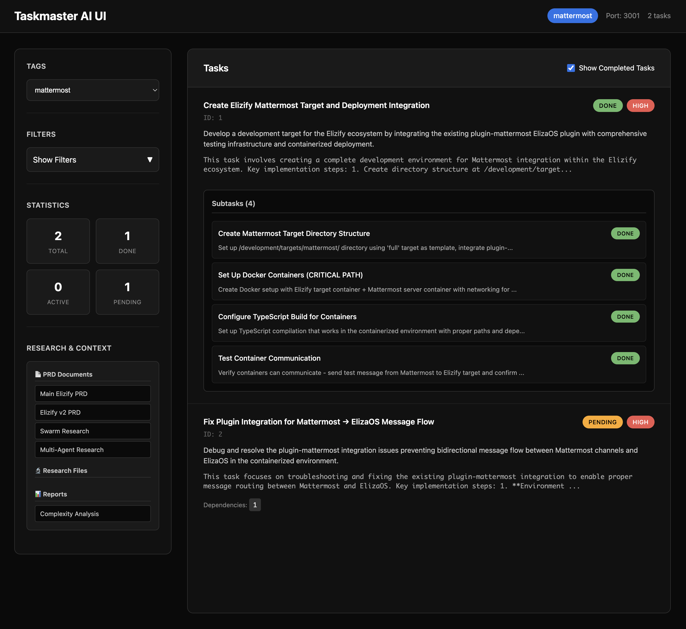

# Taskmaster UI

Simple web view to a [Taskmaster AI](https://www.task-master.dev/) database. View, filter, and explore your tasks through a browser interface stright from your project.

## Screenshot



*Taskmaster UI showing tasks with dark theme interface*

## Features

- Task visualization with status indicators
- Tag-based organization for different contexts (master, feature branches, etc.)
- Subtask management with detailed implementation notes
- Markdown document rendering for PRDs, research files, and reports
- Filtering by status, priority, subtasks
- Real-time updates when task files change
- Dark theme interface

## Quick Start

### Prerequisites

- Node.js 18+ 
- A Taskmaster AI project with `.taskmaster/` directory structure

### Installation

Clone this repository inside your project & build:
```bash
git clone https://github.com/bealers/taskmaster-ui.git
cd taskmaster-ui && npm install
```

For development with automatic rebuilding:

```bash
npm run dev
```

Alternatively:


Build the project:

```bash
npm run build
```

Run from your Taskmaster project directory:
```bash
# Navigate to your project with .taskmaster/ directory
cd /path/to/your/project

# Start the server manually
node /path/to/taskmaster-ui/dist/server.js
```

Open your browser to `http://localhost:3001`

### Alternative Usage

Specify custom path:
```bash
node dist/server.js --taskmaster=/custom/path/to/.taskmaster
```


## File Structure

The server expects your project to have a Taskmaster directory structure:

```
your-project/
├── .taskmaster/
│   ├── tasks/
│   │   └── tasks.json          # Main tasks file with tag-based organization
│   ├── state.json              # Current tag state
│   ├── docs/                   # PRD documents
│   │   ├── elizify-prd.txt
│   │   └── research/           # Research markdown files
│   └── reports/
│       └── task-complexity-report.json
└── taskmaster-ui/              # This application
```

## Usage

### Viewing Tasks

- Switch Tags: Use the dropdown to change between task contexts (master, feature branches, etc.)
- Filter Tasks: Use the collapsible filters panel to show/hide tasks by status, priority
- Hide Completed: Toggle the "Show Completed Tasks" checkbox to focus on active work
- View Details: Click any task card to see full implementation details and test strategies

### Exploring Documents

The Research & Context panel provides direct access to:
- PRD Documents: Product Requirements Documents rendered as markdown
- Research Files: Timestamped research and findings
- Reports: Complexity analysis and other generated reports

### Subtask Management

- Individual Subtasks: Each subtask appears as a clickable card within parent tasks
- Detailed View: Click any subtask to see full implementation context
- Progress Tracking: Visual status indicators show subtask completion state

## Configuration

### Port Configuration

The server runs on port 3001 by default. Set the `PORT` environment variable to change it:
```bash
PORT=8080 node dist/server.js
```

### Taskmaster Path Override

If your `.taskmaster` directory is in a non-standard location:
```bash
node dist/server.js --taskmaster=/path/to/your/.taskmaster
```

### API Endpoints

- `GET /` - Main task interface
- `GET /api/tasks` - Get all task data
- `GET /api/tasks/:tag` - Get tasks for specific tag
- `GET /api/document/:filename` - Serve PRD documents as rendered markdown
- `GET /api/research/:filename` - Serve research files as rendered markdown
- `GET /health` - Server health check

## Related Projects

- [Taskmaster AI](https://task-master.dev) - The task management system this UI visualizes

---

by [@bealers](https://bealers.com) 